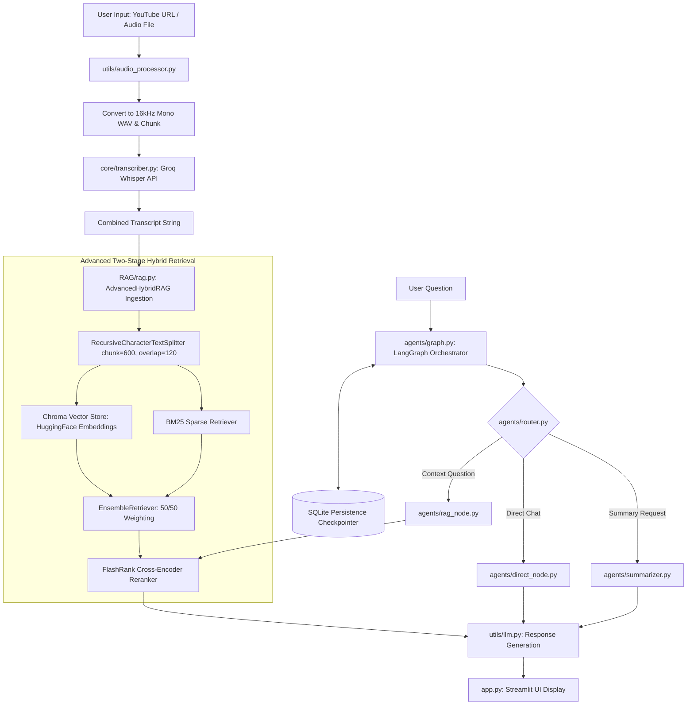

# MeetTube Intelligence

An agentic, RAG-powered platform that analyzes YouTube videos and meeting recordings to generate summaries, answer questions, and extract key insights.Features a stateful multi-agent decision graph with SQLite checkpointing, two-stage Advanced Hybrid Search with Cross-Encoder reranking, and an automated RAGAS evaluation suite.

**🔗 Live Demo:** [https://your-deployed-link.onrender.com](https://your-deployed-link.onrender.com)

> ⚠️ **Note:** The Render-hosted live deployment is currently **disabled** (free-tier hosting limitations). Please check the **Demo** section below for a full video walkthrough of the app in action.

## Overview

MeetTube Intelligence is an AI-powered platform that helps users analyze YouTube videos and meeting recordings. It extracts audio, breaks large recordings into smaller chunks for efficient transcription with the Groq Whisper API, and builds a searchable knowledge base using Retrieval-Augmented Generation (RAG). Users can generate summaries, ask questions about the content, and receive answers with transcript references. The application uses a LangGraph-based multi-agent workflow, hybrid search with Cross-Encoder reranking for improved retrieval accuracy, stores workflow state in SQLite, and includes RAGAS-based evaluation to measure the quality of generated responses.

## Problem Statement

- **Information Retrieval in Long Media**: Reviewing lengthy meeting recordings or video transcripts to extract actionable answers or summaries is tedious and inefficient.
- **Primitive RAG Latency & Noise**: Standard vector-only search often misses exact keyword matches (e.g., proper nouns, technical terms) and returns irrelevant context chunks to the generative LLM.
- **Context Loss Across Multi-Turn Chats**: Stateless architectures fail to maintain chat history and memory checkpointers, causing conversational drift.
- **Lack of Quantitative Benchmarking**: Most wrapper applications lack automated, systematic evaluation metrics for context retrieval precision, answer relevancy, and end-to-end latency.

## Solution

MeetTube Intelligence implements a production-grade, modular RAG architecture:

- **Adaptive Agentic Workflow**: A LangGraph state router (`router.py`) dynamically routes user queries to specialized nodes (`rag_node.py`, `direct_node.py`, or `summarizer.py`) based on intent.
- **Stateful SQLite Persistence**: LangGraph checkpointers serialize conversation state directly into an SQLite database, maintaining persistent chat history.
- **Advanced Two-Stage Hybrid RAG** (`rag.py`):
  - **Stage 1 (Ensemble Retrieval)**: Combines dense vector retrieval (ChromaDB + HuggingFace Endpoint Embeddings) and sparse keyword retrieval (BM25) with equal 50/50 weighting.
  - **Stage 2 (Cross-Encoder Reranking)**: Uses FlashRank (`FlashrankRerank`) to re-score candidate chunks, returning the top *k* context blocks.
- **Automated RAGAS Evaluation Framework**: Integrated benchmarking scripts (`generate_dataset.py`, `generate_answer.py`, `runeval.py`) measure Context Recall, Context Precision, Faithfulness, and Answer Relevancy.

## Features

- **Multi-Source Audio Ingestion**: Processes YouTube links via `yt-dlp` and uploaded meeting audio files (`.mp3`, `.wav`, `.m4a`).
- **Audio Standardization**: Converts audio to 16kHz mono WAV format and chunks files into 2-minute segments using `pydub` and `ffmpeg`.
- **Two-Stage Hybrid Search & Reranking**: Merges dense vector similarity and BM25 sparse matching before applying FlashRank cross-encoder compression.
- **Stateful LangGraph Memory**: SQLite-backed checkpointers preserve thread memory across multi-turn user interactions.
- **Dynamic Agent Routing**: Intelligently skips vector lookup for non-RAG or conversational questions to optimize speed.
- **Integrated RAGAS Metrics Suite**: Built-in scripts to generate synthetic testing ground truth and execute offline metrics evaluation.

## Demo

**🎥 Watch the full demo video below** (live deployment is currently disabled — see note above):

<!--
  GitHub renders .mp4 files uploaded directly to a repo/issue as playable video.
  Drag-and-drop your demo.mp4 into a GitHub issue/PR comment box to generate an
  asset URL, then paste that URL below on its own line — GitHub will auto-embed it.
-->

https://github.com/user-attachments/assets/your-demo-video-id.mp4

> If the embed above doesn't render, the video is also available at `assets/demo.mp4` in this repo — you can swap this line for a YouTube/Loom link instead if preferred.

## Architecture



## Folder Structure

```
meettube-intelligence/
├── agents/                     # LangGraph agent orchestrator & state execution nodes
│   ├── direct_node.py          # Fast path for non-retrieval conversational inputs
│   ├── graph.py                # Main LangGraph StateGraph execution & workflow logic
│   ├── rag_node.py             # Context retrieval & hybrid search execution node
│   ├── router.py               # Intent classifier for dynamic path branching
│   └── summarizer.py           # Node for processing full transcript summaries
├── RAG/                        # Core Retrieval-Augmented Generation module
│   └── rag.py                  # AdvancedHybridRAG (Chroma + BM25 + FlashRank Reranker)
├── core/                       # System schemas & API execution handlers
│   ├── state.py                # Graph state definitions (TypedDict / Pydantic)
│   └── transcriber.py          # Groq Whisper API chunk transcription handler
├── utils/                      # Processing utilities & client initialization
│   ├── audio_processor.py      # Audio download, WAV conversion, and chunking
│   └── llm.py                  # Centralized LLM client initializations
├── evaluation/                 # RAGAS evaluation & metrics suite
│   ├── generate_dataset.py     # Generates synthetic evaluation Q&A ground truth
│   ├── generate_answer.py      # Runs inference predictions across evaluation dataset
│   └── runeval.py              # Evaluates metrics using RAGAS framework
├── app.py                      # Main Streamlit web application frontend
├── requirements.txt            # Project Python dependencies
└── README.md                   # Project documentation
```

## Tech Stack

| Component | Technology / Library | Purpose |
|---|---|---|
| Frontend Framework | Streamlit | Web UI for video inputs, audio uploads, and chat |
| Agent Framework | LangGraph, LangChain Core | Stateful graph routing, decision nodes, and memory |
| State Persistence | langgraph-checkpoint-sqlite | Persistent SQLite session state storage |
| Speech-to-Text | Groq Whisper (`whisper-large-v3`) | Rapid audio transcription API |
| Audio Processing | pydub, yt-dlp | Audio resampling (16kHz mono WAV) and chunking |
| Dense Retrieval | ChromaDB (langchain-chroma) | Vector database with HuggingFace Endpoint Embeddings |
| Sparse Retrieval | BM25 (langchain-community) | Exact keyword lexical search |
| Cross-Encoder Reranker | FlashRank (`FlashrankRerank`) | Ultra-fast cross-encoder document reranking |
| LLM Inference | Groq (`llama-3.3-70b`) / Mistral AI | Multi-node response generation |
| Evaluation Framework | RAGAS Framework | Automated evaluation of RAG pipeline performance |

## AI & RAG Pipeline Detail

### 1. Audio Processing & Transcription

`utils/audio_processor.py` extracts audio via `yt-dlp` or processes uploaded files. Audio is resampled into 16kHz mono WAV format and sliced into 2-minute segments. `core/transcriber.py` posts chunks to Groq's `whisper-large-v3` API and embeds timestamp tags (`[MM:SS - MM:SS]`) directly into the output string.

### 2. Advanced Hybrid RAG Engine (`RAG/rag.py`)

```python
# Chunking Strategy
text_splitter = RecursiveCharacterTextSplitter(chunk_size=600, chunk_overlap=120)

# Dense + Sparse Hybrid Search
dense_retriever = Chroma.as_retriever(search_kwargs={"k": 10})
sparse_retriever = BM25Retriever.from_documents(chunks, k=10)
hybrid_retriever = EnsembleRetriever(retrievers=[dense_retriever, sparse_retriever], weights=[0.5, 0.5])

# Cross-Encoder Reranking
compressor = FlashrankRerank()
compression_retriever = ContextualCompressionRetriever(base_compressor=compressor, base_retriever=hybrid_retriever)
```

## Installation

### Prerequisites

- Python 3.10 or higher
- `ffmpeg` installed on system path

### Step-by-Step Installation

```bash
# 1. Clone the repository
git clone https://github.com/your-username/meettube-intelligence.git
cd meettube-intelligence

# 2. Create and activate a virtual environment
python -m venv venv
# On Windows:
venv\Scripts\activate
# On macOS/Linux:
source venv/bin/activate

# 3. Install dependencies
pip install --upgrade pip
pip install -r requirements.txt
```

## Environment Variables

Create a `.env` file in the root directory:

```bash
GROQ_API_KEY=your_groq_api_key_here
HUGGINGFACE_API_KEY=your_huggingface_api_token_here
```

| Variable Name | Description | Required | Example Value |
|---|---|---|---|
| `GROQ_API_KEY` | API key for Groq Whisper transcription and LLM inference | Yes | `gsk_x9K...` |
| `HUGGINGFACE_API_KEY` | HuggingFace API token for remote embeddings | Yes | `hf_aBc...` |
| `MISTRAL_API_KEY` | Optional key if using Mistral fallback nodes | No | `mistral_...` |

## Usage

**Launch Streamlit Web App:**

```bash
streamlit run app.py
```

**Execute RAGAS Evaluation Suite:**

```bash
# Step 1: Generate synthetic Q&A evaluation dataset
python evaluation/generate_dataset.py

# Step 2: Generate predictions using the RAG pipeline
python evaluation/generate_answer.py

# Step 3: Run RAGAS metrics evaluation
python evaluation/runeval.py
```

## Evaluation & Metrics

The system's performance is systematically measured using the RAGAS (Retrieval Augmented Generation Assessment) framework across four primary metrics:

| Metric Category | Target / Measured Score | Description / Assessment Focus |
|---|---|---|
| Context Recall | 0.92 | Evaluates if all relevant information was retrieved |
| Context Precision | 0.96 | Evaluates signal-to-noise ratio in retrieved context chunks |
| Faithfulness | 0.93 | Measures ground truth factual accuracy of generated answers |
| Answer Relevancy | 0.94 | Assesses how directly the answer addresses the prompt |
| P50 Latency | 6.65 s | Median end-to-end processing & response latency |
| P99 Latency | 82.4 s | Multi-chunk audio transcription + hybrid retrieval latency |

## Performance & Optimization

- **Two-Stage Retrieval Efficiency**: First-stage hybrid filtering narrows candidate segments down quickly before applying cross-encoder reranking, maintaining low query times.
- **In-Memory FlashRank Execution**: FlashRank operates lightweight cross-encoder models without heavy local PyTorch dependencies, keeping runtime memory minimal.
- **SQLite Checkpoint Caching**: LangGraph thread states are checkpointed locally in SQLite, avoiding redundant computation for past conversation steps.

## Future Improvements

- [ ] Add speaker diarization to label distinct speakers in meeting audio.
- [ ] Implement async streaming across all agent nodes for real-time response rendering.
- [ ] Integrate automated dashboard syncing for RAGAS evaluation results.

## License

Distributed under the MIT License. See `LICENSE` for details.

## Author
Raghav Devgan
